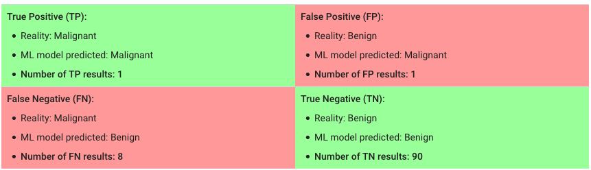

# Crash Course https://developers.google.com/machine-learning/crash-course/

## 3. Descending into ML

Key words:

* Linear regression 线性回归
* squared error 方差
* MSE(Mean square error) 平均方差

---

Concepts：

* empirical risk minimization: In supervised learning, a machine learning algorithm builds a model by examining many examples and attempting to find a model that minimizes loss.

## 4. Reducing Loss

An iterative approach is one widely used method for reducing loss.

Key words:

* gradient descent 梯度下降

---

Concepts:

* converge: You iterate until overall loss stops changing or at least changes extremely slowly. We say the model has converged.

* Gradient Descent: A technique to minimize loss by computing the gradients of loss with respect to the model's parameters, conditioned on training data. Informally, gradient descent iteratively adjusts parameters, gradually finding the best combination of weights and bias to minimize loss.

* Stocastic gradient descent(SGD): It uses only a single example(a batch size of 1) per iteration. "Stocastic" indicates the one example comprising each batch is chosen at random.

* Mini-batch stochastic gradient descent (mini-batch SGD): A compromise between full-batch iteration and SGD. A mini-batch is typically between 10 and 1000 examples, chosen at random.

## 5. First Steps with TF

Key words:

* pandas: An important library for data analysis and modeling, and is widely used in TensorFlow coding.

## 6. Generalization

## 13. Classification

True Positive(predict positive and true)  | False Positive(predict positive and false)

False Negative(predict not positive and false) | True Negative(predict not positive and true)

Tumors predict example: 

---

Key words:

* Accuracy: accuracy is the fraction of predictions our model got right. Accuracy = Number of correct predictions/ Total number of predictions

* Precision: Proportion of positive predictions was actually correct.(It's small means some more positive predictions is uncorrect)

* Recall: Proportion of actual positives was predicted correctly.(It's small means some more actual positives weren't indentified)

---

Concept:

ROC curve: 

An ROC curve (receiver operating characteristic curve) is a graph showing the performance of a classification model at all classification thresholds. 

This curve plots two parameters:
* True Positive Rate: synonym for recall, `TRP = TP/(TP+FN)` , `TP+FN` means total number of positive factor.
* False Positive Rate: `FPR = FP/(FP+TN)`, `FP+TN` means total number of negative factor.

## ML Engineering

1. Static vs. Dynamic Training

* A **static model** is trained offline. That is, we train the model exactly once and then use that trained model for a while.

* A **dynamic model** is trained online. That is, data is continually entering the system and we're incorporating that data into the model through continuous updates.

2. Static vs. Dynamic Inference

* **offline inference**: meaning that you make all possible predictions in a batch, using a MapReduce or something similar. You then write the predictions to an SSTable or Bigtable, and then feed these to a cache/lookup table.

* **online inference**: meaning that you predict on demand, using a server.

3. Data is important.

4. Bias bias bias