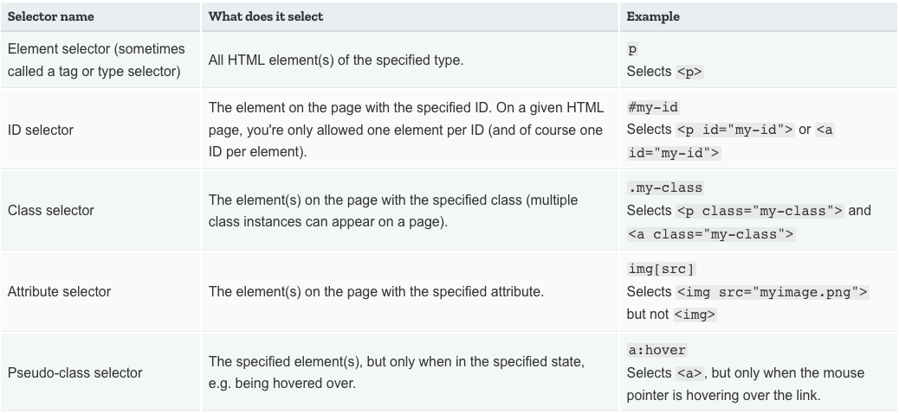

# some ticks for css


## anatomy of a CSS ruleset


## Different types of selectors(more to see)



## css layout

* padding, the space just around the content (e.g., around paragraph text)
* border, the solid line that sits just outside the padding
* margin, the space around the outside of the element


An example:
```css
body {
  width: 600px;
  margin: 0 auto;
  background-color: #FF9500;
  padding: 0 20px 20px 20px;
  border: 5px solid black;
}
```

Upper is some declarations for <body> element.

* **width: 600px;** --- this forces the body to always be 600 pixels wide

* **margin: 0 auto;** --- When you set two values on a property like margin or padding, the first value affects the element's top and bottom side (make it 0 in this case), and the second value the left and right side (here, auto is a special value that divides the available horizontal space evenly between left and right).

* **background-color: #FF9500;** --- this sets the element's background color.

* **padding: 0 20px 20px 20px;** --- we have four values set on the padding, to make a bit of space around our content. This time we are setting no padding on the top of the body, and 20 pixels on the left, bottom and right. The values set top, right, bottom, left, in that order.

* **border: 5px solid black;** --- this simply sets a 5-pixel–wide, solid black border on all sides of the body.

