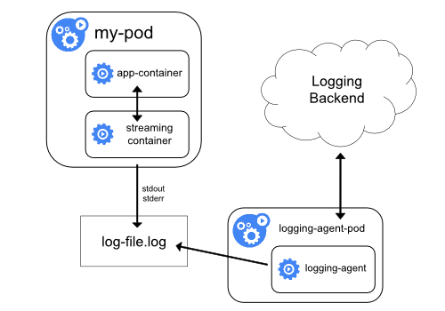

# Logging Architecture

logs should have a separate storage and lifecycle independent of nodes,pods or containers.

This concept is called cluster-level-logging.

Cluster-level looging requires a separate backend to store, analyze, and query logs.

## Basic logging in Kubernetes

kubernetes can collect stdout and stderr as logs

```bash
$ kubectl logs <pod_name>
# show the pod's logs here

$ kubectl logs <pod_name> <container_name>
# show logs of the container in the pod
```

e.g.

```yaml
apiVersion: v1
kind: Pod
metadata:
  name: counter
spec:
  containers:
  - name: count
    image: busybox
    args: [/bin/sh, -c,
            'i=0; while true; do echo "$i: $(date)"; i=$((i+1)); sleep 1; done']
```

```bash
$ kubectl create -f counter.yaml

pod "counter" created

$ kubectl logs counter

0: Thu Aug  9 11:12:21 UTC 2018
1: Thu Aug  9 11:12:22 UTC 2018
2: Thu Aug  9 11:12:23 UTC 2018
3: Thu Aug  9 11:12:24 UTC 2018
```

## Logging at the node level

Everything a containerized application writes to **stdout** and **stderr** is handled and redirected somewhere by a container engine.

Note: the Docker json logging treats each line as a separate message.

By default, if a container restarts, the kubelet keeps one terminated container with its logs. If a pod is evicted from the node, all corresponding containers are also evicted, along with their logs.

Log rotation avoids logs consuming all available storage

## Cluster-level logging architectures

Kubernetes doesn't provide a native solution for cluster-level logging, several common approaches you can consider:

1. Use node-level logging agent that runs on every node
2. Include a dedicated sidecar container for logging in an application pod
3. Push logs directly to a backend from within an application

### Using a node logging agent

each node has a node logging agent who can exposes logs or pushes logs to a backend. Commonly, the logging agent is a container that has access to a directory with log files from all of the application containers on that node.

It's common to implement it as a DaemonSet replica.

Using a node-level logging agent is a good way. It doesn't require any changes to the applications running on the node. However, it only works for applications's **stdout** and **stderr**

### Using a sidecar container with the logging agent

two ways:
* The sidecar container streams application logs to its own stdout
* The sidecar container runs a logging agent, which is configured to pick up logs from an application container

1. Streaming sidecar container


The logic is minimal which is hardly a significant overhead.

Sidecar containers can also be used to rotate log files.

2. Sidecar container with a logging agent


Using a logging agent in a sidecar container can lead to significant resource consumption. And you can't access logs using *kubectl logs*

could use any logging agent such as fluentd...

3. Exposing logs directly from the application


You can implement cluster-level logging by exposing or pushing logs directly from every application; however, the implementation for such a logging mechanism is outside the scope of Kubernetes.

Reference:

[kubernetes-document-Logging Architecture](https://kubernetes.io/docs/concepts/cluster-administration/logging/)

https://akomljen.com/get-kubernetes-logs-with-efk-stack-in-5-minutes/

https://banzaicloud.com/blog/k8s-logging/