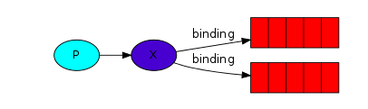

# Introduction

This is a introduction for some concepts in RabbitMQ

## concepts

to illustrate the contact of these concepts, see [constructure](#constructure)

1. producer, queue, consumer (see overview)

    * A producer is a user application that sends messages

    * A queue is a buffer that stores messages

    * A consumer is a user application that receives messages

2. Exchanges:

    Background: The core idea in the messaging model in RabbitMQ is that the producer never sends any messages directly to a queue. Actually, quite often the producer doesn't even know if a message will be delivered to any queue at all.

    The producer can only send messages to an *exchange*:

    * one side, exchange receives messages from producers

    * the other side, exchange pushes messages to queues

    * exchange has a few types(direct, topic, headers, fanout) which define rules: Should it be appended to a particular queue? Should it be appended to many queues? Or should it get discarded.
        1. fanout: broadcasts all the messages received to all the queues it knows
        2. direct: a message goes to the queues whose **routing key** matches the **routing key** of the message(created by producer).

3. Bindings: 
    
    Tell the exchange to send messages to queue.

## constructure

the following pic is the approximate connections



P: means producer

X: means exchange

binding: means the Binding

the red is queue

## codes

The following are codes for different parts

1. exchange

```go
// declare exchange
err = ch.ExchangeDeclare(
	"logs",   // name
	"fanout", // type
	true,     // durable
	false,    // auto-deleted
	false,    // internal
	false,    // no-wait
	nil,      // arguments
)
```

2. producer

```go
// declare producer
err = ch.Publish(
	"logs", // exchange
	"",     // routing key
	false,  // mandatory
	false,  // immediate
	amqp.Publishing{
		ContentType: "text/plain",
		Body:        []byte(body),
    })
```

3. queue

```go
// declare queue
q, err := ch.QueueDeclare(
    "",    // name
    false, // durable
    false, // delete when usused
    true,  // exclusive
    false, // no-wait
    nil,   // arguments
)
```

4. Binding

```go
// declare binding
err = ch.QueueBind(
	q.Name, // queue name
	"",     // routing key
	"logs", // exchange
	false,
    nil)
```

5. consumer

```go
// declare consumer
msgs, err := ch.Consume(
	q.Name, // queue
	"",     // consumer
	true,   // auto-ack
	false,  // exclusive
	false,  // no-local
	false,  // no-wait
	nil,    // args
)
```