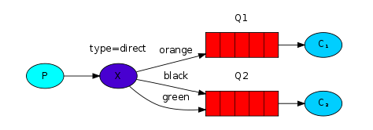
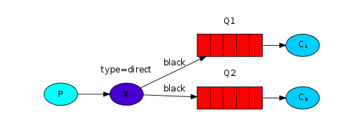
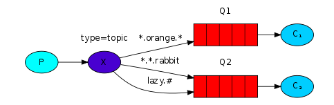

# There are several patterns in rabbitMQ

* [publish/subscribe](#publish/subscribe)

* [Topics](#topics)

## publish/subscribe

1. Broadcast messages to many consumers at once.

2. Exchange type is *fanout*

Use producer, exchange, binding, queue, consumer

emit_log_PS.go: ExchangeDeclare, Publish

receive_logs_PS.go: ExchangeDeclare, QueueDeclare, QueueBind, Consume

Concrete codes:
* [emit_log_fanout.go](./examples-codes/emit_log_fanout.go)
* [receive_log_fanout.go](./examples-codes/receive_log_fanout.go)

## Routing

1. Receiving messages selectively.

2. Exchange type is *direct*. Specify **routing-key** in publish and binding.

3. Illustration

    1. one binding to one queue

    

    we can see the **direct** exchange **X** with two queues bound to it. The first queue is bound with binding key **orange**, and the second has two bindings, one with binding key **black** and the other one with **green**.

    In such a setup a message published to the exchange with a routing key **orange** will be routed to queue Q1. Messages with a routing key of **black** or **green** will go to Q2. All other messages will be discarded

    2. one binding to multiple queues

    

    Use the same binding to bind multiple queues is legal. In this example, the *direct* exchange will behave like *fanout*, broadcast to all the matching queues

Concrete codes:
* [emit_log_direct.go](./examples-codes/emit_log_direct.go)
* [receive_log_direct.go](./examples-codes/receive_log_direct.go)

## Topics

1. Receiving messages based on a pattern(topics)

2. Exchange type is *topic*. 

    **routing-key** must be a list of words, delimited by dots(the list's limit is 255 bytes). The words can be anything, but usually they specify some features connected to the message. Examples: "quick.white.rabbit", "happy.daming"

    The binding's routing-key must in same form as the producer's routing-key. A message sent with a particular routing-key will be delivered to all the queues that are bound with a matching binding-key(routing-key in binding).

    There two special cases for binding-keys:
    * *(star) can substitute for exactly one word.
    * #(hash) can substitute for zero or more words.

3. Illustration

    

    In this example, we're going to send messages which all describe animals. The messages will be sent with a routing key that consists of three words (two dots). The first word in the routing key will describe speed, second a colour and third a species: "<speed>.<colour>.<species>".

    We created three bindings: Q1 is bound with binding key "*.orange.*" and Q2 with "*.*.rabbit" and "lazy.#".

    These bindings can be summarised as:
    * Q1 is interested in all the orange animals.
    * Q2 wants to hear everything about rabbits, and everything about lazy animals.

    Connections：
    1. message with routing-key "quick.orange.rabbit" will be delivered to both queues.
    2. message with routing-key "lazy.pink.rabbit" matches two bindings to Q2, but it will be delivered to Q2 only once.
    3. message with "lazy.orange.male.rabbit" matches "lazy.#" and will be delivered to Q2.

    |Message's routingkey    | Be delivered to   |
    |------------------------|-------------------|
    |quick.orange.rabbit     | both              |
    |lazy.orange.elephant    | both              |
    |quick.orange.fox        | only Q1           |
    |lazy.brown.fox          | only Q2           |
    |lazy.pink.rabbit        | only Q2(only once)|
    |quick.brown.fox         | none, discard     |
    |orange                  | none, discard     |
    |quick.orange.male.rabbit| none, discard     |
    |lazy.orange.male.rabbit | Q2                |

    **Notes:**
    
       * When a queue is bound with "#", it will receive all the messages. like *fanout* exchange
       * When special characters "*" and "#" aren't used in bindings, the topic exchange will behave just like a *direct* one.
