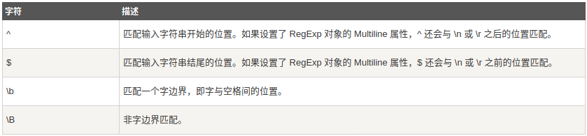

# Regular-expression(正则表达式)

## 正则表达式

正则表达式是一种文本模式，使用单个字符串来描述、匹配一系列匹配某个句法规则的字符串。

## 简介

```bash
^[0-9]+abc$
```

* ^为匹配输入字符串的开始位置

* [0-9]+匹配多个数字，[0-9]匹配单个数字，+ 匹配一个或者多个

* abc$匹配字母abc并以abc结尾，$为匹配输入字符串的结束位置

## 语法

### 普通字符

普通字符包括没有被显式指定为元字符的所有可打印和不可打印的字符。包括所有大写和小写字母、所有数字、所有标点符号等等

### 非打印字符

非打印字符也可以是正则表达式的组成部分。下表是非打印字符的转义序列：

|字符|描述|
|---|---|
|\cx|匹配由x指明的控制字符。例如， \cM 匹配一个 Control-M 或回车符。x 的值必须为 A-Z 或 a-z 之一。否则，将 c 视为一个原义的 'c' 字符。|
|\f|匹配一个换页符。等价于 \x0c 和 \cL。|
|\n|匹配一个换行符。等价于 \x0a 和 \cJ。|
|\r|匹配一个回车符。等价于 \x0d 和 \cM。|
|\t|匹配一个制表符。等价于 \x09 和 \cI。|
|\v|匹配一个垂直制表符。等价于 \x0b 和 \cK。|
|\s|匹配任何空白字符，包括空格、制表符、换页符等等。等价于 [ \f\n\r\t\v]。注意 Unicode 正则表达式会匹配全角空格符。|
|\S|匹配任何非空白字符。等价于 [^ \f\n\r\t\v]。|

### 特殊字符


### 限定符

用来指定正则表达式的一个给定组件必须出现多少次才能满足匹配。


*、+限定符都是贪婪的，因为它们会尽可能多的匹配文字，只有在它们的后面加上一个?就可以实现非贪婪或最小匹配

例如：

```bash
<H1>Chapter 1 - 介绍正则表达式</H1>
```

* 贪婪：下面的表达式匹配从开始小于符号 (<) 到关闭 H1 标记的大于符号 (>) 之间的所有内容

```bash
/<.*>/
```

* 非贪婪：如果您只需要匹配开始和结束 H1 标签，下面的非贪婪表达式只匹配 \<H1>

```bash
/<.*?>/
```

* 如果只想匹配开始的 H1 标签，表达式则是：

```bash
/<\w+?>/
```

### 定位符

定位符使您能够将正则表达式固定到行首或行尾。它们还使您能够创建这样的正则表达式，这些正则表达式出现在一个单词内、在一个单词的开头或者一个单词的结尾。

定位符用来描述字符串或单词的边界，^ 和 $ 分别指字符串的开始与结束，\b 描述单词的前或后边界，\B 表示非单词边界。



### More info: [http://www.runoob.com/regexp/regexp-tutorial.html](http://www.runoob.com/regexp/regexp-tutorial.html)