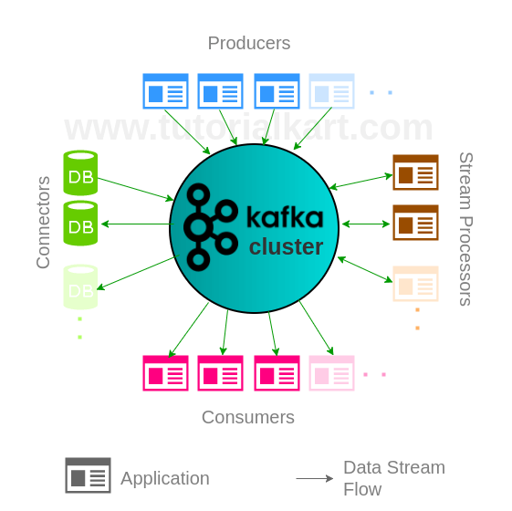
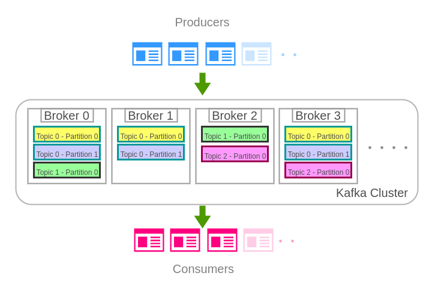

# Introduction of Kafka

Apache Kafka is a distributed streaming platform.

## start

```sh
# Start Zookeeper
sh bin/zookeeper-server-start.sh config/zookeeper.properties

# Start Kafka Server
sh bin/kafka-server-start.sh config/server.properties
```

## Concepts

* Kafka is run as a cluster on one or more servers that can span multiple datacenters. 

* The Kafka cluster stores streams of **messages** in categories called **topics**.

* Each message consists of **a key, a value, and a timestamp**.

## Architecture

Blocks of Kafka: Producers, Consumers, Processors, Connectors, Topics, Partitions and Brokers.



---
---

Brokers, Topics and their Partitions's relations:

In the following diagram, there are three topics:

Topic 0 has two partitions(partition 0,1) with 3 replications

Topic 1 and 2 both have one partition(partition 0) with 2 replications



## Topics

1.Create Kafka Topic

```sh
$ ./kafka-topics.sh --create --zookeeper <A> --replication-factor <B> --partitions <C> --topic <D>
```

| Argument | Description |
|----------|-------------|
|    A     |IP and port at which zookeeper is running                                  |
|    B     |Number of replications that the topic has to maintain in the Kafka Cluster |
|    C     |Number of partitions into which the Topic has to be partitioned            |
|    D     |Name of the Kafka Topic to be created                                      |

2.List Kafka Topic

```sh
$ ./kafka-topics.sh --list --zookeeper localhost:2181
```

3.Describe Kafka Topic

```sh
$ ./kafka-topics.sh --describe --zookeeper localhost:2181 --topic <Topic-name>
```