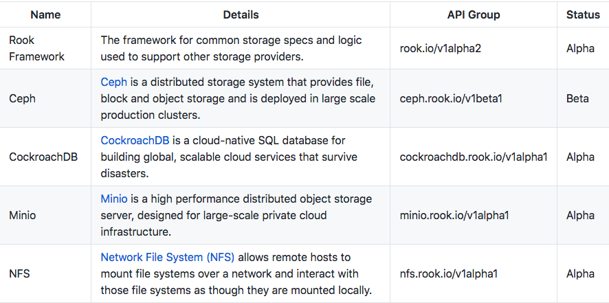

# Rook

Rook is an open source **cloud-native storage orchestrator**, providing the platform, framework, and support for a diverse set of storage solutions to natively integrate with cloud-native environments.

Project Status


## Three types of storage

1. **Block**: Create block storage to be consumed by a pod.

2. **Object**: Create an object store that is accessible inside or outside the Kubernetes cluster

3. **Shared File System**: Create a file system to be shared across 

## Block Storage

Block storage allows you to mount storage to a single pod.

Before Rook can start provisioning storage, a StorageClass and its storage pool need to be created.

**storageclass.yaml**:

```yaml
apiVersion: ceph.rook.io/v1beta1
kind: Pool
metadata:
  name: replicapool
  namespace: rook-ceph
spec:
  replicated:
    size: 1
---
apiVersion: storage.k8s.io/v1
kind: StorageClass
metadata:
   name: rook-ceph-block
provisioner: ceph.rook.io/block
parameters:
  pool: replicapool
  # Specify the namespace of the rook cluster from which to create volumes.
  # If not specified, it will use `rook` as the default namespace of the cluster.
  # This is also the namespace where the cluster will be
  clusterNamespace: rook-ceph
  # Specify the filesystem type of the volume. If not specified, it will use `ext4`.
  fstype: xfs
```

